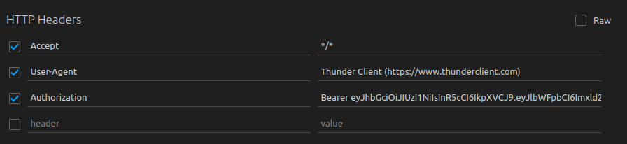
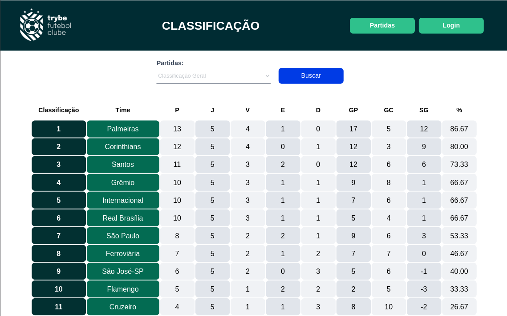
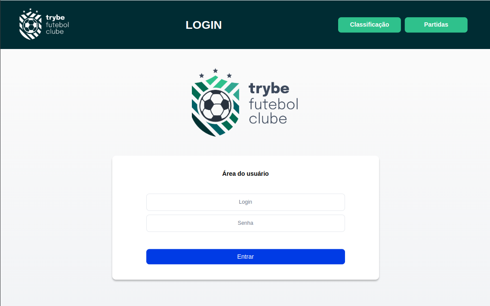
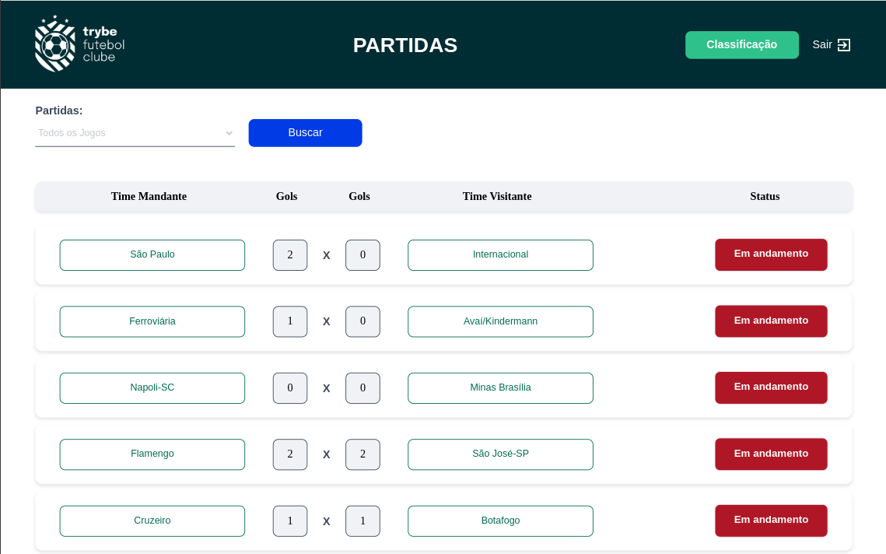

# Soccer Club

Este projeto consiste em um site informativo sobre partidas e classificações de futebol, cuja API foi desenvolvida em TypeScript POO, utilizando o Sequelize para interação com o banco de dados. A finalidade da API é fornecer dados para o front-end, implementando regras de negócio para popular adequadamente as tabelas disponíveis e realizar o login.

<details>

<summary><strong>Estrutura do projeto</strong></summary><br />

O projeto é composto de 4 entidades importantes para sua estrutura:

1️⃣ **Banco de dados:**
  - É um container docker MySQL configurado no docker-compose através de um serviço definido como `db`.
  - Tem o papel de fornecer dados para o serviço de back-end.

2️⃣ **Back-end:**
 - Roda na porta `3001`, pois o front-end faz requisições para ele nessa porta por padrão;
 - Inicializado a partir do arquivo `app/backend/src/server.ts`;

3️⃣ **Front-end:**
  - O front-end se comunica com serviço de back-end pela url `http://localhost:3001` através dos endpoints.

4️⃣ **Docker:**
  - O `docker-compose` tem a responsabilidade de unir todos os serviços conteinerizados (backend, frontend e db) e subir o projeto completo com o comando `npm run compose:up`;

</details>

</details>

<details id='sequelize'>
  <summary><strong>Diagrama de Entidade-Relacionamento</strong></summary>
  <br/>

  

</details>

## Instalação

Após realizar o clone, navegue até a raíz do projeto e instale as dependências com o comando:

```bash
npm install
```

Também é necessário instalar as dependências nos diretórios _backend_ e _frontend_, para isso basta utilizar o comando (Também na raíz do projeto):

```bash
npm run install:apps
```


## Containers

Antes de utilizar é necessário subir os containers da aplicação. Na raíz do projeto utilize o comando:

```bash
npm run compose:up
```
E quando quiser finalizar: 

```bash
npm run compose:down
```

## Funcionalidades

<details>
  <summary><strong>Back-end</strong></summary><br />

  > Caso queira utilizar, na raiz do projeto, você encontrará um arquivo Thunder Client (thunder-collection-soccer-club.json) que pode ser importado no Thunder Client para facilitar as requisições.

### Login:

  - Endpoint: `POST /login`
  - Retorna um token de acesso caso o usuário já esteja cadastrado no banco de dados.
  - O corpo da requisição deve conter o email e a senha do usuário cadastrado seguindo o formato abaixo:

     ```json
    {
      "email": "user@user.com",
      "password": "secret_user"
    }
    ```
  - Efetuando o login corretamente retornará um token neste formato:
  
    ```json
    {
      "token": "eyJhbGciOiJI[...]"
    }
    ```

    > Aviso: Para utilizar os endpoints `GET /login/role`, `GET /matches`, `GET /matches/:id/finish`, `PATCH /matches/:id`, `POST /matches`, é necessário utilizar esse token de acesso no header da requisição: </br>
     

### Role:
  - Endpoint: `GET /login/role`

### Listar Times:
  - Endpoint: `GET /teams`

### Encontrar Time Por Id:
  - Endpoint: `GET /teams/:id`

### Listar Partidas:
  - Endpoint: `GET /matches`

### Listar Partidas em Progresso:
  - Endpoint: `GET /matches?inProgress=true`

### Listar Partidas Finalizadas:
  - Endpoint: `GET /matches?inProgress=false`

### Criar Partida:
  - Endpoint: `POST /matches`
  - O corpo da requisição deve estar neste formato abaixo:
  
     ```json
     {
       "homeTeamId": 16,
       "awayTeamId": 1, 
       "homeTeamGoals": 2,
       "awayTeamGoals": 2
    }
    ```
### Atualizar Partida:
  - Endpoint: `PATCH /matches/:id`
  - O corpo da requisição precisa estar neste formato abaixo:

    ```json
    {
       "homeTeamGoals": 0,
       "awayTeamGoals": 2
    }
    ```
### Finalizar Partida:
  - Endpoint: `GET /matches/:id/finish`

### LeaderBoard Home
  - Endpoint: `GET /leaderboard/home`

### LeaderBoard Away
  - Endpoint: `GET /leaderboard/away`

### LeaderBoard Overall
  - Endpoint: `GET /leaderboard`

</details>

<details>
    <summary><strong>Front-end</strong></summary><br />

   > Após subir os containers corretamente o front-end irá rodar na porta `3000` de seu navegador.

### Página Inicial:

  

  Na página inicial você encontrará a tabela de classificação, sendo possível filtrar por: `Classificação Geral`, `Classificação Mandantes`, e `Classificação Visitantes`.

### Login:
  
  

  Caso queria efetuar o login utilize esses dados:

  <strong>Login:</strong> user@user.com<br />
  <strong>Senha:</strong> secret_user

### Partidas:

  

  Na página de partidas é possível escolher visializar: `Todos os Jogos`, `Em andamento`, e `Finalizado`.

</details>

## Contribuição

Este projeto está aberto para contribuições. Se você deseja contribuir, siga estas etapas:

1. Faça um fork do projeto
2. Crie uma nova branch (`git checkout -b feature/sua-feature`)
3. Faça commit das alterações (`git commit -m 'Adicione sua feature'`)
4. Faça push para a branch (`git push origin feature/sua-feature`)
5. Abra um Pull Request

## Contato

Para questões ou sugestões relacionadas a este projeto, sinta-se à vontade para entrar em contato via e-mail: [jonataslaguna.js@gmail.com](mailto:jonataslaguna.js@gmail.com)
